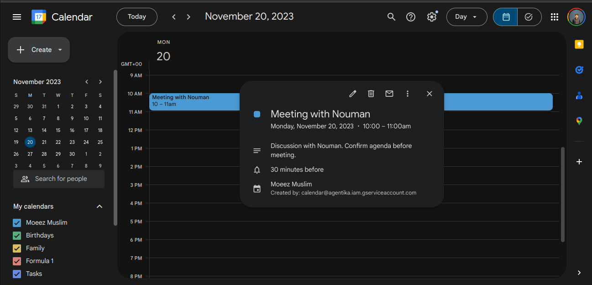

# Jarvis: Your Intelligent Assistant

Welcome to **Jarvis**, a versatile and intelligent assistant designed to streamline your project management and scheduling needs. Whether you're organizing Trello boards or scheduling meetings on Google Calendar, Jarvis is here to help you work smarter, not harder.

---

## Features

### 1. **Trello Integration**
Jarvis is deeply integrated with Trello to simplify your project management tasks.

#### Trello Functionalities:
- **List Boards**: Displays all ongoing Trello projects with links for easy access.
- **Create Lists**: Add new lists to a specific Trello board.
- **Manage Tasks**:
  - Add tasks/cards to any Trello list.
  - Assign tasks to team members by name.
  - Move tasks between lists.
  - Set due dates for tasks to keep track of deadlines.
- **Backlog Management**:
  - Input a project description, and Jarvis will divide it into tasks.
  - Automatically create a `Project Name Backlog` list and populate it with tasks.
  - Optionally set a due date for all tasks in the backlog.


---

### 2. **Google Calendar Integration**
Jarvis takes care of your scheduling needs by integrating with Google Calendar.

#### Calendar Functionalities:
- **Schedule Meetings**:
  - Create new events with details like title, description, start time, and end time.
  - Automatically sync events with your Google Calendar.
- **Smart Reminders**:
  - Ensure you're always on top of your meetings with scheduled reminders.



---

## Getting Started

Follow these steps to set up and start using Jarvis:

### Prerequisites:
- **Trello Account**: Ensure you have a Trello account with API Key and Token.
- **Google Calendar Credentials**: Obtain the necessary API credentials by creating a project in the Google Developer Console.

### Setup Instructions:

1. **Clone the Repository**:
   ```bash
   git clone <repository-url>
   cd jarvis-assistant
   ```

2. **Install UpStreet's USDK**:
   ```bash
   npm install -g usdk
   ```

3. **Environment Variables**:
   Create a `secrets.ts` file with the following keys:
   ```env
   TRELLO_API_KEY=<your-trello-api-key>
   TRELLO_API_TOKEN=<your-trello-api-token>
   GOOGLE_CALENDAR_ID=<your-calendar-id>
   GOOGLE_API_KEY=<your-google-api-key>
   GOOGLE_SERVICE_ACCOUNT_EMAIL=<your-service-account-email>
   GOOGLE_PRIVATE_KEY=<your-private-key>
   ```

4. **Start the Application and chat with Jarviss**:
   ```bash
   usdk chat
   ```

---

## How It Works

1. **Interact with Jarvis**:
   - Simply type your commands, such as:
     - "What are my ongoing projects?"
     - "Create a list 'To-Do' in the 'Marketing' board."
     - "Assign the task 'Review Proposal' to 'John Doe' in the 'To-Do' list."
     - "Schedule a meeting titled 'Project Kickoff' for tomorrow at 10 AM."

2. **Seamless Execution**:
   - Jarvis processes your request and takes the necessary actions using Trello and Google Calendar APIs.

3. **Instant Feedback**:
   - Get real-time responses confirming your request has been completed.

---

## Why Choose Jarvis?
- **Time Saver**: Automates repetitive tasks, freeing you to focus on strategic work.
- **Integrated**: Works seamlessly with Trello and Google Calendar.
- **User-Friendly**: Intuitive commands and real-time feedback.
- **Customizable**: Easily extend functionalities to meet your unique needs.

---

## Contribution
We welcome contributions to make Jarvis even better! Feel free to submit a pull request or raise issues for bugs and feature requests.

---

## License
This project is licensed under the MIT License. See the LICENSE file for more details.

---

Start simplifying your workflows today with **Jarvis**!

